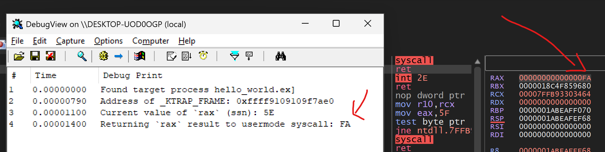

# Hells Hollow

Hell's Hollow is a Windows 11 compatible rootkit technique that is equivalent to a modern (PatchGuard and HyperGuard) resistant technique to effectively
perform SSDT Hooking (System Service Dispatch Table) - bypassing all previous defence mechanisms put in the kernel.

This technique works by abusing an undocumented Alternate Syscall handler mechanism in the kernel, within which we are able to directly
alter the KTRAP_FRAME, allowing us to effectively hook the SSDT in Windows 11. We are able to decide to either let the OS continue to dispatch the 
system call (and giving us the ability to alter the arguments passed to it), or to alter it on behalf of the dispatcher, and return straight back to 
userland - so the calling application thinks the system call was dispatched normally.

- [Blog post on Hells Hollow](https://fluxsec.red/hells-hollow-a-new-SSDT-hooking-technique-with-alt-syscalls-rootkit)
- [Blog post on Alt Syscalls internals](https://fluxsec.red/alt-syscalls-for-windows-11)

Shoutout to [@sixtyvividtails](https://x.com/sixtyvividtails) who made a key [observation](https://x.com/sixtyvividtails/status/1950581722070069404) in my first implementation of this, that the KTRAP discovery can be simplified
by reading directly from the KTHREAD. The repo is now updated to reflect this, and it now works even better with no stack modification required!

Altering the return value from a syscall via the hook:



## Setup

I have uploaded this repo as a MVP for producing the technique (in RUst). If you are new to Rust, and simply want to get it up
and running, follow the environment config steps at [Windows Rust Drivers](https://github.com/microsoft/windows-drivers-rs) project and run `cargo make`.

It will spit our a driver that you can simply load with OSR or whatever tool you want. This POC is designed to hook `NtTraceEvent` in the kernel (via Alt Syscalls),
it will modify the return value to 0xff in `rax` to usermode. 

If you want to test this out on a SSN of your choice that isn't `NtTraceEvent`, then make a program called `hello_world.exe` (this rootkit currently filters on that)
and in [alt_syscalls.rs](https://github.com/0xflux/Hells-Hollow/blob/master/src/alt_syscalls.rs) change which SSN you want to hook, which is currently defined as:

```rust
const NT_TRACE_EVENT_SSN: u32 = 0x005e;
```

Then, via either a kernel debugger for the Alt Syscall callback / trap, or a usermode debugger on the syscall itself, you'll see what's going on under the hood.

Video POC coming soon with a bit more of an explanation on what is going on, until then, read my blog :).

### References

- [Alt Syscalls for Windows 11 - 0xflux](https://fluxsec.red/alt-syscalls-for-windows-11)
- [System Calls Tracing & Monitoring via Alternative Handlers - Xacone](https://xacone.github.io/BestEdrOfTheMarketV3.html#4)
- [WinAltSyscallHandler - 0xcpu](https://github.com/0xcpu/WinAltSyscallHandler/tree/master)
- [Symbols](https://www.vergiliusproject.com/kernels/x64/windows-11/24h2)